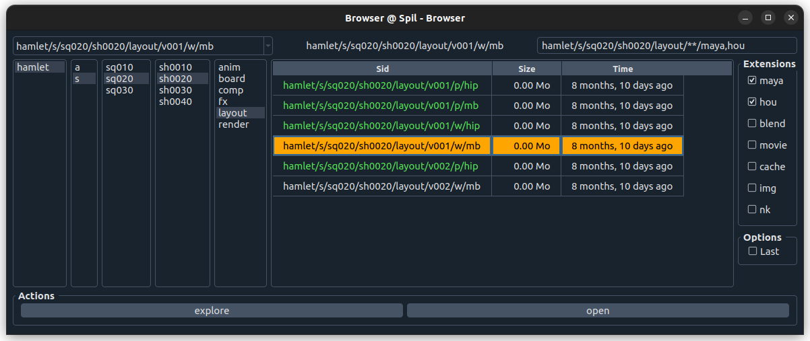

# Spil UI

Spil UI is part of [Spil, the Simple Pipeline Lib](https://github.com/MichaelHaussmann/spil).

It ships a dynamic Sid Browser and Action launcher.

[](https://github.com/MichaelHaussmann/spil_ui)

The **Browser** finds Sids (Scene IDs) using Spil's `Finder` classes.
It is dynamic, and adapts to the Sids length and content.

The UI is built using [QtPy](https://github.com/spyder-ide/qtpy), and [QDarkStyle](https://github.com/ColinDuquesnoy/QDarkStyleSheet), and works with PyQt5, PySide2, PyQt6, PySide6.
(Spil works with python >=3.7)

It runs on all major DCCs as well as standalone. It was tested in Maya, Houdini, Nuke, and others.

ActionHandlers can be implemented to show and call actions matching the selected Sid.    
An example ActionHandler is included (with "explore" and "open" actions).


## Documentation

To lean more about **spil**, please visit [spil.readthedocs.io](https://spil.readthedocs.io)

Usage documentation of **spil_ui**: [Usage](docs/usage.md).

Technical overview of **spil_ui**: [Tech Notes](docs/notes.md).

## Installation

spil_UI can be pip installed.

```shell
# Install latest release (recommended)
pip install spil_ui

# Or install from repo 
pip install git+https://github.com/MichaelHaussmann/spil_ui.git
```
It installs `spil_ui`, `spil` and its dependencies.
It also installs `spil_hamplet_conf`, a sample configuration. 

A Qt package must be installed separately: PySide2, or PySide6.
```shell
pip install PySide2
```

### Running

If you need test data, you can initialize dummy files and folders from the sample configuration: 
```python
import spil  # adds spil_hamlet_conf to the python path
import hamlet_scripts.save_examples_to_mock_fs as mfs
mfs.run()
```

Then you can run the app.
```python
from spil_ui import app
app()
```

Note: from within a DCC already running a QApplication Instance, run:
```python
from spil_ui import open_browser
open_browser()
```

## Limitations

Although it has been and is used in production, the current version of spil_ui is quite rudimentary.
It is work in progress. There are still hard coded elements in the browser.
General code cleanup is planned (typing, tests, etc.).

Spil_UI has been released as early beta to help demonstrate the usage of Spil.

### Todo

- code: cleanup, documentation, typing, formatting (apologies to you reader)
- window opening size and position, better default, and store for user
- stylesheet & choice of light/dark
- tab order (and arrows left/right) for mouseless navigation
- arrow keys (up/down) in listwidgets
- last action in conf for double click / default action
- double-click "unsticks"
- actions refresh browser when done
- use Getter to show images

## Contact

Don't hesitate to get in touch : [spil@xeo.info](mailto:spil@xeo.info).  
We will be happy to respond.  

**spil_ui** is released under MIT licence.

<br>

*This documentation is work in progress.*
