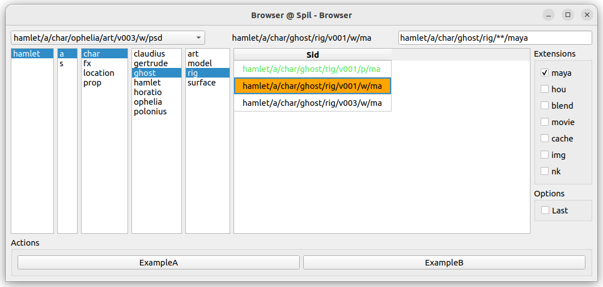

# Spil Qt UI

A simple Qt UI for [Spil](https://github.com/MichaelHaussmann/spil).

Spil_UI is a Qt browser UI, built on top of Qt.py.  

Navigating through the columns builds a "Search Sid" and calls it on a Finder.  
It is possible to run actions on the currently selected Sid.  
